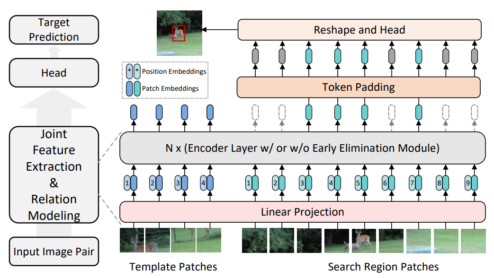
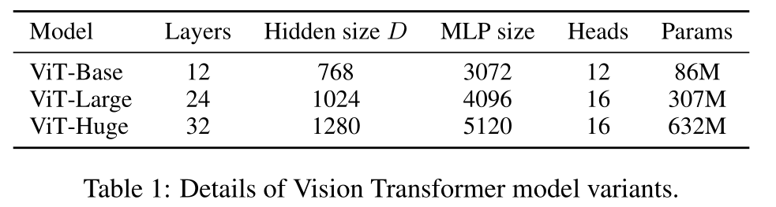
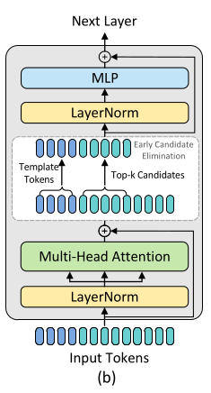

# Implementing the OSTrack from scratch!

This repository implements the OSTrack (one-stream) framework introduced in this [paper](https://arxiv.org/abs/2203.11991) using PyTorch.

For the uninitiated, this framework allows one-shot object tracking across a frame sequence which may/may not contain it. 
It takes as input two images - a template image which contains the object to track, and the (search) image in which this object's location has to be reported.

Thus it is possible to crop the object from the first frame of the sequence as the template image of the object to track this object in all the subsequent frames. 
To aid the tracking process, template images are cropped to maximize the size of the object, which also minimizes the background elements present in the image.

Typically, frameworks first perform feature extraction on the template and search images, and then uses the relation between these features for state estimation task (termed as relation-modeling). 
Unlike other frameworks that segregate these two steps, OSTrack leverages the transformer architecture to combine these steps into one.

Sample outputs are shown below, from left to right: 
1. Input Search Image
2. Input Template Image
3. Remaining search image tokens after layer 4, 7, 10
4. Classifier Score Output (as a heatmap, from purple(tends to 0) to yellow(tends to 1))
5. Final output image with the bounding box


[//]: # (TODO &#40;Anshu-man567&#41;: Should I also mention the two advantages of this approach + SoTA &#40;back when it was written&#41;. Also check and mention the FPS rate achieved. It was ~50FPS for the 1080p images from GOT10k.)

## Features of this implementation
* Implements OSTrack-256 version of the framework from scratch, complete with a ViT-B/16 model, the early candidate elimination module, and the FCN (Fully Convolutional Network) prediction head specific to this framework. 
* Each component was written from scratch to develop a modular and leaner application. Follows clearer naming conventions closer to that used for other ViT models for better understandability.
* Interoperable with the weights available in the original implementation: https://github.com/botaoye/OSTrack#evaluation for evaluation purposes
* Below is a comprehensive overview of the architecture
* OSTrack-256 achieves ~50FPS for the 1080p images from GOT10k

## Model Overview
As stated above, the model accepts as input a template image and a search image. These images are then split into multiple patches, each of size 16x16 pixels. Next, the patches for the template and the search image is passed together to the transformer backbone to generate the feature-rich tokens. Lastly, these tokens are then passed through a predictor head which predicts the desired attributes.



In the paper, **VIT-Base** pre-trained using **MAE** (Masked Auto Encoders) was used as the transformer backbone. 

The only difference from the vanilla implementation of ViT-B was the inclusion of an Early Candidate Elimination module. 
It is responsible for eliminating patches with lower attention scores at select layers of the transformer backbone.

The prediction head of ViT is replaced with a FCN head which outputs:
i. The classifier scores 
ii. Prediction of the size of bounding box and
iii. The prediction of the center of bounding box
for each of the search region patches input to the model.

The section on detailed design (below) covers the nitty gritties about each module.

## Detailed Design
The OSTrack framework was implemented in two variants, each accepting different dimensions of the template and search images: 
– OSTrack-256. Template: 128×128 pixels; Search region: 256×256 pixels
– OSTrack-384. Template: 192×192 pixels; Search region: 384×384 pixels

Below is the detailed design covering the OSTrack-256 variant (but for the most parts, is also applicable to the OSTrack-384 variant), with information about each of the steps.

### Input Processing
Before passing the patches to transformer backbone, the following steps takes place:

##### 1. Creating the patches
##### 1. Creating the patches
The template and search images are split into two groups of patches of size 16x16 pixels, each. Next, these patch groups are linearly embedded with the same weights.

##### 2. Adding the Position Embeddings
Since we are using a pre-trained model as the starting point, we have trained weights for the position embeddings. The number of patches during pre-training is different from the number of patches for the template and search groups, thus the weights are interpolated.

The number of patches during pre-training is 196 (as the ViT-B/16 variant takes as input 224x224 sized images), thus corresponding to 196 different embedding, one for each position.
This is then interpolated to 64 dimensions, which is the number of patches for the template image.
This is also interpolated to 256 dimensions, which is the number of patches for the search image.
Both of these values are then stored locally for usage later.

##### 3. Append the groups
Lastly, the two groups of patches are appended into a single group of patches, to form a 320-dimension (64+256) vector of patches before passing it to the transformer backbone.

### Transformer Backbone : ViT-Base/16
The ViT-B/16 model used for this framework is the lightest model of the ViT family, with 12 transformer layers, 768 as the hidden dimesion size and 3072 (ie 4x of hidden dimesnio size) as the MLP size, leading to 86M parameters. An overview of how the different ViT variants stack against each other is present below.
 
NOTE: In order to perform classification, ViT adds an extra learnable "classification token" to the sequence. But for OSTrack ablation studies (provided in the paper), confirmed that the extra learnable tokens didnt improve the downstream task's performance. Thus, it has been omitted.



Each transformer layer perfom the following operations in some order:
* MHSA : Multi-Head Self Attention,
* MLP : Multi-Layer Perceptron,
* Layer Norm : Layer Normalization,
* Residual Connection (denoted by Add below) and,
* CE (early Candidate Elimination).

While a typical ViT (and OSTrack without CE) has the operations in the following sequence: `Layer Norm` -> `MHSA` -> `Add & (Layer) Norm` -> `MLP` -> `Add` and then move to the Next Layer

OSTrack uses this sequence of operations: `Layer Norm` -> `MHSA` -> `CE Module` (only in transformer layers 4, 7, 10) -> `Add & (Layer) Norm` -> `MLP` -> `Add`
and then move to the Next Layer



### Candidate Elimination (CE) Block

Empirically, it was observed that by as early as the 4th transformer layer the attention weights highlight the foreground objects and then progressively focus on the target. Thus, making it possible to progressively identify and eliminate search tokens belonging to the background regions.

[//]: # (TODO &#40;Anshu-man567&#41; : Add an image of this empricial thing &#40;prefereably from your own runs... and for all layers from 1 to 12&#41;)

Since the attention weights are calculated as part of the self-attention operation in ViT measure the similarity between each token pair these weights can serve as a similarity score to aggregate candidates corresponding to the k most probable candidates.

The authors in the paper use just the center part of the orignal template image to estimate the similarity. 

[//]: # (TODO &#40;Anshu-man567&#41;:<exaplin why>)

[//]: # (TODO &#40;Anshu-man567&#41;:  Explain what is spatial aggregation and why the paper talks about center part being able to aggregate template token info. Recall that the self-attention operation in ViT can be seen as a spatial aggregation of tokens with normalized importance which is measured by the dot product similarity between each token pair. )

Alternatively the authors also test other parts of the template tokens to use for similarity calculation. Its results demonstrated that the different selections affected the quality of identifying background candidates. The case where all template tokens were used performed worse than the case where no CE block was present, which could be attributed to the presence of background region in the template image. Compared to other choices, using just the central template token provides the best performance.

Thus the CE block accumulates the top-k candidates from the search group, to forward to the next layer using the similarity scores from the central template token.

[//]: # (TODO &#40;Anshu-man567&#41;: Explain how the multi-head thing is working here.)

We only keep the candidates corresponding to the k largest (top-k) elements. The number of search tokens forwareded for the next operation depend on the value of token keeping ratio (if =1.0 means all the tokens are sent, likewise if =0.6 then only the top  60% of tokens are sent). 
The top-k tokens maintain the order as they were present earlier, and are appended with the template tokens before passing it to the next step.

These blocks are only present in a few layers of the transformer model to balance the effects of removing tokens. 

[//]: # (TODO : Add more information - i&#41; about why just selective layers ii&#41;Talk about reshape and padding at the last layer in this case!! iii&#41; ....)
[//]: # (iv&#41; Section 4.3A => Effect of ECE)


### OSTrack FCN Head
Firstly, we discard the tokens for template patches, and only make use of tokens of the search patches. Next we re-interpret the padded sequence of search region tokens to a 2D spatial feature map and then feed it into a fully convolutional network (FCN), which consists of **4 stacked Conv-BN-ReLU** layers for **each output**. 

The size of each layer decreases from `768x256 (input)` -> `256x256 (C1)` -> `128x256 (C2)` -> `64x256 (C3)` -> `32x256 (C4)` -> `1x32 or 2x32 (C5, output)`

Below is a diagram which shows the effects of convolving the `768x16x16` input tokens generated by the belonging to the search image. The final ouput is a map of either `1x16x16` or `2x16x16` containing the respective scores. 


Since we have square images as the input, the output dimension ` N_out = (H_x/P) = (W_x/P) `

Outputs generated are:
1. Classification score map, P = [0, 1] of size ` (N_out * N_out) `
2. Offset within the patch,  O = [0, 1) of size ` (2 * N_out * N_out) `
3. Bounding box dimensions,  S = [0, 1] of size ` (2 * N_out * N_out) `

These outputs need to be further processed to get the bounding box co-ordinates `{x, y, w, h}` as follows:
1. Get the co-ordinates `(x_d, y_d)` which are the coordinates (x,y) from classification score map (P) that has the highest score.
2. The exact coordinates of the bounding box center is computed using the offest map value (O), as the `(x_d, y_d)` coordinate correspond to a patch, and not an exact pixel of the image. The two information needs to be combined to calculate exact pixel location which is the center of the bounding box.

```
{x, y} = {((x_d + O[0, x_d, y_d]) / N_out) * 256,
          ((y_d + O[1, x_d, y_d]) / N_out) * 256}

here, 256 is the dimension of search image
```
3. The size of the bounding box `{w, h}` is directly available as the outputs of the bounding box dimensions map (S), thus equates to `{S[0, x_d, y_d], S[1, x_d, y_d]}`

### My implementation classes
OSTrack(nn.Module)  ---> Input = the combined search and template patches; Output = the bbox over search patches 
1. Patchifier() ---> Parse the input images from file paths and preprocess them for OSTrack's ML components; x2 for search and template
2. VisionTransformerModel(nn.Module)  ---> Encapsulates ML preprocessing of patches + ViTEncoder
   * InputLayer(nn.Module)  ---> Apply the patch embedding ie linearize from 3D patches & apply posn embeds
   * ViTEncoder(nn.Module)  ---> Consists of the ViT Encoder to generate the enriched patches 
     * MultiHeadSelfAttention(nn.Module)
     * EliminationModule: Candidate Elimination Module (TBD)
     * MultiLayerPerceptron(nn.Module)   
3. OSTrackDecoder(nn.Module) ---> Using the feature rich patches, generate the Classifier Scores, Offset Map and Size Map to use for Bounding Box calculations

[//]: # (TODO &#40;Anshu-man567&#41;: Write about-SeqOSTrack&#40;&#41; )


### CLI Usage

#### Command Line Interface

The tracker can be configured through both YAML config files and command line arguments. CLI arguments override the corresponding YAML config values.

#### Basic Usage
```bash
python3 ostrack_appl/test.py [options]
```

#### Configuration Options

| Argument | Type | Default | Description |
|----------|------|---------|-------------|
| `--config` | str | `ostrack_appl/ostrack_config.yaml` | Path to YAML config file |
| `--show-dumps` | int | 0 | Enable visualization dumps (0 or 1) |
| `--print-stats` | int | 0 | Enable debug statistics printing (0 or 1) |
| `--en-ece` | int | 1 | Enable early candidate elimination (0 or 1) |
| `--save-outputs` | int | 0 | Enable saving of output results (0 or 1) |
| `--hidden-dim` | int | 768 | Hidden dimension size for the model |
| `--search-size` | int | 256 | Size of search area image |
| `--template-size` | int | 128 | Size of template image |
| `--pretrained-weights` | str | "" | Path to pretrained model weights |

#### Example Usage

1. Using default configuration:
```bash
python3 ostrack_appl/test.py
```

2. Enable visualization and statistics:
```bash
python3 ostrack_appl/test.py --show-dumps 1 --print-stats 1
```

3. Using custom weights and saving outputs:
```bash
python3 ostrack_appl/test.py --pretrained-weights weights/model.pth.tar --save-outputs 1
```

4. Using a custom config file:
```bash
python3 ostrack_appl/test.py --config path/to/custom_config.yaml
```


### References
1. (OSTrack Paper) Joint Feature Learning and Relation Modeling for Tracking: A One-Stream Framework - https://arxiv.org/abs/2203.11991
2. (ViT Paper) An Image is Worth 16x16 Words: Transformers for Image Recognition at Scale - https://arxiv.org/abs/2010.11929